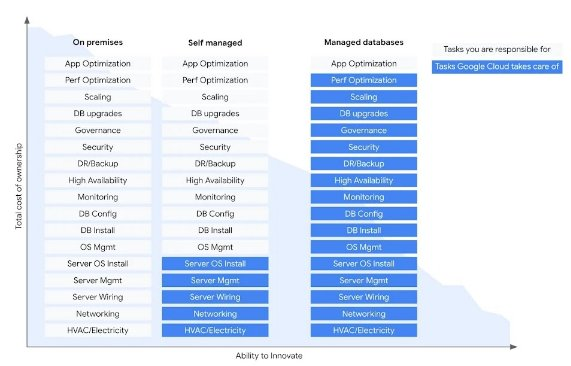

Name : Khushi Agarwal

Roll no:-79

Division: TY-CS-B

**Problem statement Lab 6: Cloud Storage Database in any CSP**

**What is cloud Database?**

A cloud database is a database built to run in a public or hybrid cloud environment to help organize, store, and manage data within an organization. Cloud databases can be offered as a managed database-as-a-service (DBaaS) or deployed on a cloud-based virtual machine (VM) and self-managed by an in-house IT team.

Types of cloud databases

- **Relational cloud databases** consist of one or more tables of columns and rows and allow you to organize data in predefined relationships to understand how data is logically related. These databases typically use a fixed data schema, and you can use structured query language (SQL) to query and manipulate data. They are highly consistent, reliable, and best suited to dealing with large amounts of structured data. 

  Examples include SQL Server, Oracle, MySQL, PostgreSQL, Spanner, and Cloud SQL.

- **Non-relational cloud databases** store and manage unstructured data, such as email and mobile message text, documents, surveys, rich media files, and sensor data. They don’t follow a clearly-defined schema like relational databases and allow you to save and organize information regardless of its format. 

  Examples include MongoDB, Redis, Cassandra, Hbase, and Cloud Bigtable.

**BENEFITS**

The amount of data generated and collected today is growing exponentially. It’s not only more varied, but also wildly disparate. Data can now reside across on-premises databases and distributed cloud applications and services, making it difficult to integrate using traditional approaches. In addition, real-time data processing is becoming essential to business success—delays and lags in data delivery to mission-critical applications could have catastrophic consequences.  

As cloud adoption accelerates and the way we use data continues to evolve, legacy databases face significant challenges. Cloud databases provide flexibility, reliability, security, affordability and more. Providing a solid foundation for building modern business applications. They can rapidly adapt to changing workloads and demands without increasing the workload of already overburdened teams

**GOOGLE CLOUD DATABASE in GCP**

Google Cloud Platform offers variety of cloud solutions including:

- Cloud Spanner
- Cloud SQL
- Cloud Bigtable
- BigQuery
- Firestore
- MemoryStore
- MongoDB Atlas
- Firebase
- Bare metal solution for Oracle

**CLOUD SPANNER:** 

Fully managed relational database with unlimited scale, strong consistency, and up to 99.999% availability.** 

**Features:**

- **Write and read scalability with no limits:** Spanner decouples compute resources from data storage, which makes it possible to transparently scale in and out processing resources. Each additional compute capacity can process both reads and writes, providing effortless horizontal scalability. Spanner optimizes performance by automatically handling the sharding, replication, and transaction processing.

- **Automated maintenance:** Synchronous replication and maintenance are automatic and built in. 100% online schema changes and maintenance while serving traffic with zero downtime**.**

- **PostgreSQL interface**: Combine the scalability and reliability of Spanner with the familiarity and portability of a PostgreSQL interface.

- **Automatic database sharding:** Built-in sharding automatically distributes data to optimize for performance and availability. Scale up and scale down without interruption.

- **Vector search**: Search vector embeddings at virtually unlimited scale in Spanner with exact nearest neighbor (KNN) vector search (in preview) for highly partitionable workloads, where each search is constrained to data associated with a particular user. These workloads are a great fit for Spanner’s built-in KNN search capabilities which allow Spanner to efficiently reduce the search space to provide accurate, real-time results with low latencies.
**

- **Vertex AI integrations:** Perform online inference on embedding, generative AI, or custom models served in Vertex AI using Spanner’s ML.PREDICT SQL function.

- **LangChain integration:** Easily build gen AI applications that are more accurate, transparent and reliable with LangChain integration. Spanner has three LangChain integrations—Document loader for loading and storing information from documents, Vector stores for enabling semantic search, and Chat Messages Memory for enabling chains to recall previous conversations.

- **Strong transactional consistency**: Rely on industry-leading external consistency without compromising on scalability or availability.

- **Single-region and multi-region configurations: A**pps backed by Spanner can read and write up-to-date strongly consistent data globally. Additionally, when running a multi-region instance, your database is protected against a regional failure and offers industry-leading 99.999% availability.

- **Real-time change data capture and replication**: Use Datastream to deliver change data from Oracle and MySQL databases into Spanner for up-to-date information. Use Spanner change streams to capture change data from Spanner databases and integrate it with other systems for analytics, event triggering, and compliance.** 

- **High-performance, workload-isolated query processing:** Spanner Data Boost enables users to run analytical queries, batch processing jobs, or data export operations faster without affecting the existing transactional workload. Fully managed by Google Cloud, Data Boost does not require capacity planning or management. It is always hot, ready to process user queries directly on data stored in Spanner's distributed storage system, Colossus. This on-demand, independent compute resource lets users easily handle mixed workloads and worry-free data sharing. 
- **AI-powered code assistance:** Duet AI in Spanner helps developers write SQL queries faster. It provides code suggestions to structure, modify, or query your data based on natural language prompts. Duet AI in Spanner is currently in Preview.

- **Rich application and tool support:** Development teams are with native client libraries for Java/JDBC, Go, Python, C#, Node.js, PHP, Ruby, and C++ as well as the most popular ORMs, including Hibernate and Entity Framework.

- **Observability**: Monitor performance of Spanner databases with metrics and stats. Analyze usage patterns in Spanner databases with Key Visualizer, an interactive monitoring tool. Use query insights for troubleshooting query performance issues and quickly diagnose lock contention issues with lock insights and transaction insights.

- **Enterprise-grade security and controls**: Customer-managed encryption keys (CMEK), data-layer encryption, IAM integration for access and controls, and comprehensive audit logging. Support for VPC-SC, Access Transparency, and Access Approval. Fine-grained access control lets you authorize access to Spanner data at the table and column level. 

- **Backup and restore, point-in-time recovery (**PITR): Backup your database to store a consistent copy of data and restore on demand. PITR provides continuous data protection with the ability to recover your past data to a microsecond granularity.

- **Relational interface:** Everything you would expect from a relational database—schemas, SQL queries, and ACID transactions—at any scale. Use Google Standard SQL or a PostgreSQL interface.

- **Granular instance sizing:** Start with Spanner with a granular instance for only $65/month and scale it based on your needs without downtime and with no need for re-architecting. 

**Cloud SQL**

Fully managed relational database service for MySQL, PostgreSQL, and SQL Server.

**Features:**

- **Fully managed:** Cloud SQL manages your databases so you don't have to, so your business can run without disruption. It automates all your backups, replication, patches, encryption, and storage capacity increases to give your applications the reliability, scalability, and security they need.

- **Open and standards-based:** Cloud SQL supports the most popular open source and commercial engines, including MySQL, PostgreSQL, and SQL Server with rich support for extensions, configuration flags, and popular developer tools. It's easy to get started—simply bring your existing skills over and enjoy the flexibility to work the way you want. You can create a database with just a few clicks in the console and connect your application.

- **Cost-effective:** Scale as your application grows, customize machine types, and choose different levels of performance and availability, up to a 99.99% availability SLA. 

- **Intelligent insights and manageability:** View AI/ML-driven insights and recommendations for performance, security, reliability, and cost. Quickly understand and resolve database performance issues through pre-built dashboards and visual query plans using Cloud SQL Insights. Cloud SQL with Active Assist uses advanced analytics and ML to identify over-provisioned and idle instances in your fleet and alert you as needed.

- **Easy migrations:** Database Migration Service (DMS) can migrate it securely and with minimal downtime. DMS leverages the native replication capabilities of the source database to maximize the reliability of your migration. 

- **Vector search:** Vector search is a critical capability for building useful and accurate gen AI-powered apps. Cloud SQL for PostgreSQL and MySQL support two search approaches for balancing speed and accuracy. Approximate nearest neighbor (ANN) vector search is ideal for large datasets where close matches suffice, while exact nearest neighbor (KNN) vector search is used for precision. Integrate vector search directly into your existing database for real-time search context without learning a separate system.

- **LangChain integration:** Build gen AI applications that are more accurate, transparent, and reliable with LangChain integration. The three LangChain integrations are Document loader for loading and storing information from documents, Vector stores for enabling semantic search, and Chat Messages Memory for enabling chains to recall previous conversations. 

- **Integrated:** Cloud SQL seamlessly integrates with Google Cloud services, such as Compute Engine, Cloud Run, Google Kubernetes Engine, and Cloud IAM, allowing developers to build and deploy applications with ease. Provision your database via APIs and third-party tools, and use federated queries from BigQuery and low-latency database replication with Datastream for near real-time insights on operational data.

- **High availability:** Configure built-in high availability (HA) with automatic failover across zones with just a click of a button to provide isolation from many types of infrastructure, hardware, and software failures. Optimize your database costs depending on your application—choose a 99.99% availability SLA (inclusive of maintenance) for business-critical transactional workloads or a 99.95% availability SLA to lower your costs.

- **Data protection and compliance** Configure backups for data protection and restore your instance to an earlier point in time with a retention period of up to 35 days. Configure where your data is stored to comply with data residency requirements. Cloud SQL automatically encrypts data, is SSAE 16, ISO 27001, and PCI DSS compliant, and supports HIPAA compliance. 

- **Secure access and connectivity:** Cloud SQL data is encrypted when on Google’s internal networks and when stored in database tables, temporary files, and backups. It supports private connectivity with Virtual Private Cloud (VPC), and every Cloud SQL instance includes a network firewall, allowing you to control public network access.

- **Scalability:** Easily scale up as your data grows, add processor cores, RAM, and storage, and scale out by adding read replicas to handle increasing read traffic. Cloud SQL can also automatically scale up storage capacity when you are near your limit. 

- **Near-zero downtime for maintenance:** Cloud SQL offers near-zero downtime of less than 10 seconds for planned maintenance. It also offers flexible maintenance window features like advance email notification and the ability to reschedule by 28 days, pick specific times for maintenance, and deny maintenance for up to 90 days.

- **Data cache:** Cloud SQL can automatically accelerate your applications using built-in performance management techniques. Cloud SQL for MySQL also leverages flash memory on your database instance to lower read latency and improve throughput by intelligently caching data across memory and high speed storage.

- **Change data capture and replication:** Stream data across heterogeneous databases, storage systems, and applications reliably and with minimal latency with Datastream. Scale up or down with a serverless architecture and no resources to provision or manage, and enable near real-time insights on operational data.

**BigQuery**

Serverless, highly scalable, and cost-effective multi cloud data warehouse designed for business agility.

**FEATURES**

- **Unified experience for all analytics users:** BigQuery Studio provides a single, unified interface for all data practitioners of various coding skills to simplify analytics workflows from data ingestion and preparation to data exploration and visualization to ML model creation and use. It also allows you to use simple SQL to access Vertex AI foundational models directly inside BigQuery for text processing tasks, such as sentiment analysis, entity extraction, and many more without having to deal with specialized models.

- **Duet AI in BigQuery:** An AI collaborator integrated into BigQuery, Duet AI in BigQuery provides contextual code assistance for writing SQL and Python. It auto-suggests functions, code blocks, and fixes. With chat assistance, you can use natural language to get real-time guidance on performing specific tasks, reducing your need to search for documentation

- **Flexibility, predictable pricing, and best price performance:** BigQuery editions allow you to pick the right feature set for individual workload requirements with the ability to mix and match for the right price-performance. Compute capacity autoscaling adds fine-grained compute resources in real time to match the needs of your workload demands, and ensure you only pay for the compute capacity you use. 

- **Built-in machine learning:** BigQuery ML enables data scientists and data analysts to build and operationalize ML models on planet-scale structured, semi-structured, and now unstructured data directly inside BigQuery, using simple SQL—in a fraction of the time. Export BigQuery ML models for online prediction into Vertex AI or your own serving layer. 

- **Analyze and share data across clouds:** BigQuery Omni is a fully managed, multicloud analytics solution that allows for cost-effective and secure data analysis across clouds and shares results within a single pane of glass. Within BigQuery Analytics Hub, securely exchange data assets internally and across organizations and enhance analysis with commercial, public, and Google datasets. Create and manage data clean rooms for privacy-centric measurement, data sharing, and collaboration across organizations without moving or copying data.

- **Real-time analytics with streaming data pipelines:** BigQuery has built-in capabilities that ingest streaming data and make it immediately available to query, along with native integrations to streaming products, like Dataflow. Analyze large datasets interactively with BigQuery BI Engine, an in-memory analysis service that offers sub-second query response time and high concurrency. Accelerate query performance and reduce costs within your environment with BigQuery materialized views.

- **Unify, manage, and govern all types of data:** Query all data types with BigQuery: structured, semi-structured, and unstructured. Use BigLake to explore and unify different data types and build advanced models. Centrally discover, manage, monitor, and govern data across data lakes, data warehouses, and data marts with consistent controls with Dataplex, an intelligent data fabric that enables organizations to provide access to trusted data.

- **Share insights with built-in business intelligence:** With built-in business intelligence, create and share insights in a few clicks with Looker Studio or build data-rich experiences that go beyond BI with Looker. Analyze billions of rows of live BigQuery data in Google Sheets with familiar tools, like pivot tables, charts, and formulas, to easily derive insights from big data with Connected Sheets. 

- **Data governance and security:** BigQuery's integration with security and privacy services from Google Cloud provides strong security and fine-grained governance controls, down to the column level and row level. Rest assured knowing your data is encrypted at rest and in transit by default. 
- **Geospatial analysis with BigQuery:** BigQuery geospatial uniquely combines the serverless architecture of BigQuery with native support for geospatial analysis, so you can augment your analytics workflows with location intelligence. Simplify your analyses, see spatial data in fresh ways, and unlock entirely new lines of business with support for arbitrary points, lines, polygons, and multi-polygons in common geospatial data formats.

- **Real-time change data capture and replication:** Synchronize data across heterogeneous databases, storage systems, and applications reliably and with minimal latency with Datastream. Datastream integrates with purpose-built and extensible Dataflow templates to pull change streams written to Cloud Storage, and create up-to-date replicated tables in BigQuery for real-time analytics.

 

**Bigtable**

Highly-performant, fully managed NoSQL database service for large analytical & operational workloads.

**FEATURES**

- **Low latency and high throughput:** Bigtable is a key-value and wide-column store, ideal for fast access to structured, semi-structured, or unstructured data. Latency-sensitive workloads like personalization are perfect for Bigtable but its high read and write throughput per dollar efficiency makes it also a great fit for clickstream and IoT use cases, and even batch analytics for high-performance computing (HPC) applications, including training ML models.

- **Write and read scalability with no limits:** Bigtable decouples compute resources from data storage, which makes it possible to transparently adjust processing resources. Each additional node can process reads and writes equally well, providing effortless horizontal scalability. Bigtable optimizes performance by automatically scaling resources to adapt to server traffic, handling the sharding, replication, and query processing.
- **Data model flexibility:** Bigtable lets your data model evolve organically. Store anything from scalars, JSON, Protocol Buffers, Avro, Arrow to embeddings, images, and dynamically add/remove new columns as needed. Deliver low-latency serving or high-performance batch analytics over raw, unstructured data in a single database.

- **Easy migration from NoSQL databases:** Live migrations enable faster and simpler onboarding by ensuring accurate data migration with reduced effort. HBase Bigtable replication library allows for no-downtime live migrations with import and validation tools 

- **Rich application and tool support:** Easily connect to the open-source ecosystem with the Apache HBase API. Build data-driven applications faster with seamless integrations with Apache Spark, Hadoop, GKE, Dataflow, Dataproc, Vertex AI Vector Search, and BigQuery. 

- **No hidden costs:** No IOPS charges, no cost for taking or restoring backups, no disproportionate read/write pricing to impact your budget as your workloads evolve.

- **Automated maintenance:** Reduce operational costs and improve reliability for any database size. Replication and maintenance are automatic and built-in with zero downtime.

- **Real-time change data capture and eventing:** Use Bigtable change streams to capture change data from Bigtable databases and integrate it with other systems for analytics, event triggering, and compliance.

- **Enterprise-grade security and controls:** Customer-managed encryption keys (CMEK) with Cloud External Key Manager support, IAM integration for access and controls, support for VPC-SC, Access Transparency, Access Approval and comprehensive audit logging help ensure your data is protected and complies with regulations.

- **Observability:** Monitor performance of Bigtable databases with server-side metrics. Analyze usage patterns with Key Visualizer interactive monitoring tool. Use query stats, table stats, and the hot tablets tool for troubleshooting query performance issues and quickly diagnose latency issues with client-side monitoring.

- **Disaster recovery:** Take instant, incremental backups of your database cost-effectively and restore on demand. Store backups in different regions for additional resilience, easily restore between instances, or projects for test vs production scenarios.

- **Vertex AI Vector Search integration:** Use the Bigtable to Vertex AI Vector Search template to index data in your Bigtable database with Vertex AI to perform a similarity search over vector embeddings with Vertex AI Vector Search.

- **LangChain integration:** Easily build generative AI applications that are more accurate, transparent, and reliable with LangChain integration. 

**Memorystore**

Scalable, secure, and highly available in-memory service for Redis and Memcached.

features

- **Choice of engines:** Choose from the most popular open source caching engines to build your applications. Memorystore supports Redis Cluster, Redis, and Memcached and is fully protocol compatible.

- **Fully managed:** Provisioning, replication, failover, and patching are all automated, which drastically reduces the time you spend doing DevOps.

- **Highly scalable	:** Memorystore for Redis Cluster provides zero-downtime scaling up to 250 nodes, terabytes of keyspace, and 60x more throughput with microsecond latencies. Memorystore for Redis and Memcached enable scaling on-demand with minimal downtime.

- **Connectivity:** Memorystore for Redis Cluster is available with Private Service Connect (PSC) to simplify management and to offer secure, private, and granular connectivity with minimal IP consumption. Memorystore for Redis and Memcached support Private Service Access (PSA) and Direct Peering to offer connectivity via private IP.

- **Vector search:** Use Memorystore for Redis as an ultra-low latency data store for your generative AI applications. Approximate nearest neighbor (ANN) vector search (in preview) delivers fast, approximate results—ideal for large datasets where a close match is sufficient. 

- **LangChain integration	:** Easily build gen AI applications that are more accurate, transparent and reliable with LangChain integration
- **Security:** Memorystore is protected from the internet using VPC networks and private IP and comes with IAM integration—all designed to protect your data. Systems are monitored 24/7/365, ensuring your applications and data are protected. Memorystore for Redis provides in-transit encryption and Redis AUTH to further secure your sensitive data.

- **Monitoring:** Monitor your instance and set up custom alerts with Cloud Monitoring. You can also integrate with OpenCensus to get more insights to client-side metrics.

- **Highly available:** Memorystore for Redis Cluster offers a 99.99% SLA with automatic failover. Shards are automatically distributed across zones for maximum availability. 

- **Migration:** Memorystore is compatible with open source protocol which makes it easy to switch your applications with no code changes

**Firestore**

Highly-scalable document database service for mobile, web, and server development.

- **Serverless:** Fully managed, serverless database that effortlessly scales up or down to meet any demand, with no maintenance windows or downtime.

- **Powerful query engine	:** Firestore allows you to run sophisticated ACID transactions against your document data to provide more flexibility in the way you structure your data.

- **AI integrations	:** Rich, turn-key extensions to integrate Firestore AI services. Enables use cases, such as automated language translations, image classification, and more.

- **Easily share data between Firestore and BigQuery:** Capture changes to your documents in Firestore and replicate changes to BigQuery. Easily pull data from BigQuery into Firestore to add analytics to your apps.

- **Security:** Firestore seamlessly integrates with Firebase Authentication and Identity Platform, to enable customizable identity-based security access controls and enables data validation via a configuration language.

- **Multi-region replication:** With automatic multi-region replication and strong consistency, your data is safe and has a 99.999% availability guarantee, even when disasters strike.

- **Live synchronization and offline mode:** Built-in live synchronization and offline mode make it easy to build multi-user, collaborative applications on mobile web, and IoT devices, including workloads consisting of live asset tracking, activity tracking, real-time analytics, media and product catalogs, communications, social user profiles, and gaming leaderboards.

- **Libraries for popular languages:** Application development using Firestore client-side development libraries for Web, iOS, Android, Flutter, C++, and Unity. It also supports traditional server-side development libraries using Node.js, Java, Go, Ruby, and PHP.

- **Datastore mode:** Firestore supports the Datastore API. You won't need to make any changes to your existing Datastore apps, and you can expect the same performance characteristics and pricing with the added benefit of strong consistency. 

- **LangChain integration	:** Easily build gen AI applications that are more accurate, transparent, and reliable with LangChain integration. Firestore has two LangChain integrations - Document loader for loading and storing information from documents and Chat Messages Memory for enabling chains to recall previous conversations. 

**Firebase Realtime Database**

Cloud-hosted NoSQL database to store and sync data in real time.

**FEATURES**

- **Real time syncing for JSON data:** The Firebase Realtime Database is a cloud-hosted NoSQL database that lets you store and sync data between your users in real time.

- **Collaborate across devices with ease:** Realtime syncing makes it easy for your users to access their data from any device: web or mobile, and helps collaborate with one another.

- **Build serverless apps:** Realtime Database ships with mobile and web SDKs so you can build apps without the need of servers. You can also execute backend code that responds to events triggered by your database using Cloud Functions for Firebase.

- **Optimized for offline use**When your users go offline, the Realtime Database SDKs use local cache on the device to serve and store changes. When the device comes online, the local data is automatically synchronized.

- **Strong user-based security:** The Realtime Database integrates with Firebase Authentication to provide simple and intuitive authentication for developers. You can use our declarative security model to allow access based on user identity or with pattern matching on your data.

**Bare Metal Solution for Oracle**

Lift and shift Oracle workloads to the Google Cloud with minimal risk.

**Features**

**Seamlessly access all Oracle capabilities:** Service catalog provides analogous topologies to all Oracle Maximum Availability Architecture templates. Migrate Oracle workloads. Maintain all your current playbooks, support runbooks, databases administrator teams, and system integrators.

**Integrated support and billing:** Enjoy a seamless experience with support for infrastructure, including defined SLAs for initial response, defined enterprise-grade SLA for infrastructure uptime and interconnect availability, 24/7 coverage for all Priority 1 and 2 issues, and unified billing across Google Cloud and Bare Metal Solution for Oracle.

**Industry-leading data protection:** Meet demanding compliance requirements with industry certifications such as ISO, PCI DSS, and HIPAA. Copy data management and backups provided by Actifio, fully integrated into Bare Metal Solution for Oracle.

**Tools and services to simplify operations:** Automate day-to-day operational database administrator tasks by either using Google’s open source Ansible based toolkit or Google Cloud's Kubernetes operator for Oracle

**MongoDB Atlas**

Global cloud database service for modern applications.

