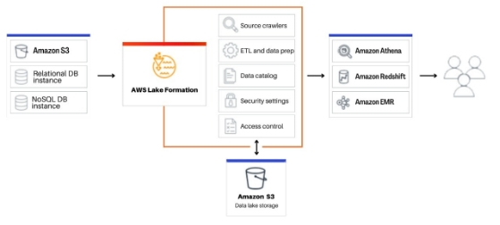

**Problem statement Lab 6:** 

- **Explore VPC of AWS.** 
- **Explore Firewall**
- **Security Lake.** 
- **WAF Shield.** 
- **AWS key management service**

1) **VPC:** 

   

A virtual private cloud (VPC) is a virtual network dedicated to your AWS account. It is logically isolated from other virtual networks in the AWS Cloud. 

A VPC spans all of the Availability Zones in a Region. After you create a VPC, you can add one or more subnets in each Availability Zone.

**VPC Addressing**: When you create a VPC, you specify its IP addresses as follows:

- IPv4 only – The VPC has an IPv4 CIDR block but does not have an IPv6 CIDR block.

- Dual stack – The VPC has both an IPv4 CIDR block and an IPv6 CIDR block.

**FEATURES OF VPC:** The following features help you configure a VPC to provide the connectivity that your applications need:

- *Virtual private clouds (VPC):* A VPC is a virtual network that closely resembles a traditional network that you'd operate in your own data center. After you create a VPC, you can add subnets.

- *Subnets:* A subnet is a range of IP addresses in your VPC. A subnet must reside in a single Availability Zone. After you add subnets, you can deploy AWS resources in your VPC.

- *IP addressing*: Both IPv4 and IPv6 can be assigned to VPCs and subnets. Public IPv4 addresses and IPv6 GUA addresses to can be used in AWS and allocate them to resources in the VPC, such as EC2 instances, NAT gateways, and Network Load Balancers.

- *Routing*: Use route tables to determine where network traffic from your subnet or gateway is directed.

- *Gateways and endpoint*: A gateway connects your VPC to another network. Use a VPC endpoint to connect to AWS services privately, without the use of an internet gateway or NAT device.

- *Peering connections*: Use a VPC peering connection to route traffic between the resources in two VPCs.

- *Traffic Mirroring*: Copy network traffic from network interfaces and send it to security and monitoring appliances for deep packet inspection.

- *Transit gateways:* Use a transit gateway, which acts as a central hub, to route traffic between your VPCs, VPN connections, and AWS Direct Connect connections.

- *VPC Flow Logs:* A flow log captures information about the IP traffic going to and from network interfaces in your VPC.

- *VPN connections:* Connect your VPCs to your on-premises networks using AWS Virtual Private Network (AWS VPN).

**How Amazon VPC works?**

With Amazon Virtual Private Cloud (Amazon VPC),  launch AWS resources in a logically isolated virtual network that you've defined. This virtual network closely resembles a traditional network that you'd operate in your own data center, with the benefits of using the scalable infrastructure of AWS.

The following is a visual representation of a VPC and its resources from the Preview pane shown when you create a VPC using the AWS Management Console.

This example shows the resources that are initially selected on the Create VPC page when you choose to create the VPC plus other networking resources. This VPC is configured with an IPv4 CIDR and an Amazon-provided IPv6 CIDR, subnets in two Availability Zones, three route tables, an internet gateway, and a gateway endpoint. Because we've selected the internet gateway, the visualization indicates that traffic from the public subnets is routed to the internet because the corresponding route table sends the traffic to the internet gateway.

**Create Amazon VPC:**

- AWS Management Console — Provides a web interface that you can use to access your VPCs.

- AWS Command Line Interface (AWS CLI) — Provides commands for a broad set of AWS services, including Amazon VPC, and is supported on Windows, Mac, and Linux. 

- AWS SDKs — Provides language-specific APIs and takes care of many of the connection details, such as calculating signatures, handling request retries, and error handling

- Query API — Provides low-level API actions that you call using HTTPS requests. Using the Query API is the most direct way to access Amazon VPC, but it requires that your application handle low-level details such as generating the hash to sign the request, and error handling.

1) **Firewall**

AWS Network Firewall is a stateful, managed, network firewall and intrusion detection and prevention service for virtual private cloud (VPC) that is created in Amazon Virtual Private Cloud (Amazon VPC).

With Network Firewall, you can filter traffic at the perimeter of your VPC. This includes filtering traffic going to and coming from an internet gateway, NAT gateway, or over VPN or AWS Direct Connect. Network Firewall uses the open source intrusion prevention system (IPS), Suricata, for stateful inspection. Network Firewall supports Suricata compatible rules

Network Firewall can be used to monitor and protect Amazon VPC traffic 

- Pass traffic through only from known AWS service domains or IP address endpoints, such as Amazon S3.
- Use custom lists of known bad domains to limit the types of domain names that your applications can access.
- Perform deep packet inspection on traffic entering or leaving your VPC.
- Use stateful protocol detection to filter protocols like HTTPS, independent of the port used.

![
    The figure shows a
     firewall
     subnet directly above a customer subnet. Inside the firewall subnet is a rules
     engines container for packet inspection. From above the left half of the
     firewall subnet, a vertical grey arrow labeled "incoming packets" points down to
     the rules engines inside the firewall subnet. From the left side of the rules
     engines, a horizontal red arrow labeled "drop incoming" points left to a large
     red X that sits outside the firewall subnet. From the bottom left of the rules
     engine, a vertical green arrow labeled "pass" points down from the firewall
     subnet rules engines to the customer subnet. From the upper right of the
     customer subnet, a grey arrow labeled "outgoing packets" points up to the rules
     engines in the firewall subnet. From the right side of the rules engines, a
     horizontal red arrow labeled "drop ourgoing" points right to a large red X that
     sits outside the firewall subnet. From the top right of the rules engine, a
     vertical green arrow labeled "pass" points up from the rules engines to outside
     the firewall subnet.
   ](Aspose.Words.7cfb0328-d3c1-4745-9882-3967346fa285.008.png)

**Key Concepts:** The following are the key concepts for Network Firewall:

- *Virtual private cloud (VPC)* – A virtual network dedicated to your AWS account.

- *Internet gateway* – A gateway that you attach to your VPC to enable communication between resources in your VPC and the internet.

- *Subnet* – A range of IP addresses in your VPC. Network Firewall creates firewall endpoints in subnets inside your VPC, to filter network traffic. In a VPC architecture that uses Network Firewall, the firewall endpoints sit between your protected subnets and locations outside your VPC.

- *Firewall subnet* – A subnet that you've designated for exclusive use by Network Firewall for a firewall endpoint. A firewall endpoint can't filter traffic coming into or going out of the subnet in which it resides, so don't use your firewall subnets for anything other than Network Firewall.

- *Route table* – A set of rules, called routes, that are used to determine where network traffic is directed. 

- *Regions and endpoints* **–** To reduce data latency in your applications, AWS Network Firewall offers a regional endpoint to make your requests:

- *Network Firewall firewall* – An AWS resource that provides traffic filtering logic for the subnets in a VPC.

- *Network Firewall firewall policy* – An AWS resource that defines rules and other settings for a firewall to use to filter incoming and outgoing traffic in a VPC.

- *Network Firewall rule group* – An AWS resource that defines a set of rules to match against VPC traffic, and the actions to take when Network Firewall finds a match. Network Firewall uses stateless and stateful rule group types, each with its own Amazon Resource Name (ARN).

- *Stateless rules* – Criteria for inspecting a single network traffic packet, without the context of the other packets in the traffic flow, the direction of flow, or any other information that's not provided by the packet itself.

- *Stateful rules* – Criteria for inspecting network traffic packets in the context of their traffic flow.

**Accessing AWS Network Firewall**

- AWS Management Console – Provides a web interface for managing the service. The procedures throughout this guide explain how to use the AWS Management Console to perform tasks for Network Firewall.

- AWS Command Line Interface (AWS CLI) – Provides commands for a broad set of AWS services, including Network Firewall. The CLI is supported on Windows, macOS, and Linux.

- AWS Network Firewall API – Provides a RESTful API. The REST API requires you to handle connection details, such as calculating signatures, handling request retries, and handling errors.

- AWS SDKs – Provide language-specific APIs. If you're using a programming language that AWS provides an SDK for, you can use the SDK to access AWS Network Firewall. The SDKs handle many of the connection details, such as calculating signatures, handling request retries, and handling errors. They integrate easily with your development environment, and provide easy access to Network Firewall commands

- AWS Tools for Windows PowerShell – Let developers and administrators manage their AWS services and resources in the PowerShell scripting environment.

- AWS CloudFormation – Helps you model and set up your Amazon Web Services resources so that you can spend less time managing those resources and more time focusing on your applications that run in AWS. You create a template that describes all the AWS resources that you want and AWS CloudFormation takes care of provisioning and configuring those resources for you.

**How Network Firewall propagates your changes**

- When you make any changes to a firewall, including changes to any of the firewall's components, like rule groups, TLS inspection configurations, and firewall policies, Network Firewall propagates the changes everywhere that the firewall is used. Your changes are applied within seconds, but there might be a brief period of inconsistency when the changes have arrived in some places and not in others. For example, if you modify a rule group so that it drops an additional type of packet, for a firewall that uses the rule group, the new packet type might briefly be dropped by one firewall endpoint while still being allowed by another.

- This temporary inconsistency can occur when you first create a firewall and when you make changes to an existing firewall. Generally, any inconsistencies of this type last only a few seconds.

- When you add a TLS inspection configuration to an existing firewall, Network Firewall interrupts traffic flows that match the criteria defined by the TLS inspection configuration scope configuration. Network Firewall will begin SSL/TLS decryption and inspection for new connections to the firewall.

- Changes to stateful rules are applied only to new traffic flows. Other firewall changes, including changes to stateless rules, are applied to all network packets.
1) **AWS Lake** 

AWS Lake Formation helps you centrally govern, secure, and globally share data for analytics and machine learning. Lake Formation, helps manage fine-grained access control for data lake data on Amazon Simple Storage Service (Amazon S3) and its metadata in AWS Glue Data Catalog.

Lake Formation provides its own permissions model that augments the IAM permissions model. Lake Formation permissions model enables fine-grained access to data stored in data lakes through a simple grant or revoke mechanism, much like a relational database management system (RDBMS). Lake Formation permissions are enforced using granular controls at the column, row, and cell-levels across AWS analytics and machine learning services, including Amazon Athena, Amazon QuickSight, Amazon Redshift Spectrum, Amazon EMR, and AWS Glue.

The Lake Formation hybrid access mode for AWS Glue Data Catalog lets you secure and access the cataloged data using both Lake Formation permissions and IAM permissions policies for Amazon S3 and AWS Glue actions. With hybrid access mode, data administrators can onboard Lake Formation permissions selectively and incrementally, focusing on one data lake use case at a time.

Lake Formation also allows you to share data internally and externally across multiple AWS accounts, AWS organizations or directly with IAM principals in another account providing fine-grained access to the AWS Glue Data Catalog metadata and underlying data.

**Features**

Lake Formation helps you break down data silos and combine different types of structured and unstructured data into a centralized repository. First, identify existing data stores in Amazon S3 or relational and NoSQL databases, and move the data into your data lake. Then crawl, catalog, and prepare the data for analytics. Next, provide your users with secure self-service access to the data through their choice of analytics services.

**Data ingestion and management** 

- ***Import data from databases already in AWS***: Once you specify where your existing databases are and provide your access credentials, Lake Formation reads the data and its metadata (schema) to understand the contents of the data source. It then imports the data to your new data lake and records the metadata in a central catalog.

- ***Import data from other external sources:*** You can use Lake Formation to move data from on-premises databases by connecting with Java Database Connectivity (JDBC). Identify your target sources and provide access credentials in the console, and Lake Formation reads and loads your data into the data lake. To import data from databases other than the ones listed above, you can create custom ETL jobs with AWS Glue

- ***Catalog and label your data:*** You can use AWS Glue crawlers to read your data in Amazon S3 and extract database and table schema and store that data in a searchable AWS Glue Data Catalog. Then, use Lake Formation Lake Formation tag-based access control (TBAC) to manage permissions on databases, tables, and columns.

**Security management** 

- ***Define and manage access controls:*** Lake Formation provides a single place to manage access controls for data in your data lake. You can define security policies that restrict access to data at the database, table, column, row, and cell levels. These policies apply to IAM users and roles, and to users and groups when federating through an external identity provider

- ***Hybrid access mode:*** Lake Formation hybrid access mode provides the flexibility to selectively enable Lake Formation permissions for databases and tables in your AWS Glue Data Catalog. With hybrid access mode, you now have an incremental path that allows you to set Lake Formation permissions for a specific set of users without interrupting the permission policies of other existing users or workloads.

- ***Implement audit logging:*** Lake Formation provides comprehensive audit logs with CloudTrail to monitor access and show compliance with centrally defined policies. You can audit data access history across analytics and machine learning services that read the data in your data lake via Lake Formation. This lets you see which users or roles have attempted to access what data, with which services, and when.

- ***Row and cell-level security:***Lake Formation provides data filters that allow you to restrict access to a combination of columns and rows. Use row and cell-level security to protect sensitive data like Personal Identifiable Information (PII)

- ***Tag-based access control:*** Use Lake Formation tag based access control to manage hundreds or even thousands data permissions by creating custom labels called LF-Tags. LF-Tags make sure that data governance can be scaled easily by replacing the policy definitions of thousands of resources with a few logical tags. Lake Formation provides a text-based search over this metadata, so your users can quickly find the data they need to analyze.

- ***Cross account access:***Lake Formation permission management capabilities simplify securing and managing distributed data lakes across multiple AWS accounts through a centralized approach

**Data sharing**

- ***Integrating Lake Formation with Amazon Redshift data sharing*** – Use Lake Formation to centrally manage database, table, column, and row-level access permissions of Amazon Redshift datashares and restrict user access to objects within a datashare.

- ***Connecting AWS Glue Data Catalog to external metastores* –** Connect AWS Glue Data Catalog to external metastores to manage access permissions on data sets in Amazon S3 using Lake Formation. No migration of metadata into the AWS Glue Data Catalog is necessary.

- ***Integrating Lake Formation with AWS Data Exchange*** – Lake Formation supports licensing access to your data through AWS Data Exchange.

**KEY CONCEPTS**

**Data lake:** The data lake is your persistent data that is stored in Amazon S3 and managed by Lake Formation using a Data Catalog. A data lake typically stores the following:

- Structured and unstructured data
- Raw data and transformed data

**Data access:** Lake Formation provides secure and granular access to data through a new grant/revoke permissions model that augments AWS Identity and Access Management (IAM) policies.

**Hybrid access mode:** Hybrid access mode lets you secure and access the cataloged data using both Lake Formation permissions and IAM and Amazon S3 permissions. Hybrid access mode allows data administrators to onboard Lake Formation permissions selectively and incrementally, focusing on one data lake use case at a time.

**Blueprint:** A blueprint is a data management template that enables you to easily ingest data into a data lake. Lake Formation provides several blueprints, each for a predefined source type, such as a relational database or AWS CloudTrail logs. From a blueprint, you can create a workflow. Blueprints take the data source, data target, and schedule as input to configure the workflow.

**Workflow:** A workflow is a container for a set of related AWS Glue jobs, crawlers, and triggers. You create the workflow in Lake Formation, and it executes in the AWS Glue service. Lake Formation can track the status of a workflow as a single entity. Workflows that you create in Lake Formation are visible in the AWS Glue console as a directed acyclic graph (DAG). 

**Data Catalog:** The Data Catalog is your persistent metadata store. It is a managed service that lets you store, annotate, and share metadata in the AWS Cloud in the same way you would in an Apache Hive metastore. It provides a uniform repository where disparate systems can store and find metadata to track data in data silos, and then use that metadata to query and transform the data. Each AWS account has one Data Catalog per AWS Region.

**Underlying data:** Underlying data refers to the source data or data within the data lakes that Data Catalog tables point to.

**Principal:** A principal is an AWS Identity and Access Management (IAM) user or role or an Active Directory user.

**Data lake administrator:** A data lake administrator is a principal who can grant any principal any permission on any Data Catalog resource or data location. Designate a data lake administrator as the first user of the Data Catalog. This user can then grant more granular permissions of resources to other principals.

**WAF Shield**

AWS WAF is a web application firewall that lets you monitor the HTTP and HTTPS requests that are forwarded to your protected web application resources. AWS WAF lets you control access to your content. Based on conditions that you specify, such as the IP addresses that requests originate from or the values of query strings, your protected resource responds to requests either with the requested content, with an HTTP 403 status code (Forbidden), or with a custom response.

- Allow all requests except the ones that you specify
- Block all requests except the ones that you specify
- Count requests that match your criteria
- Run CAPTCHA or challenge checks against requests that match your criteria

**BENEFITS**

- Additional protection against web attacks using criteria that you specify. 

- Rules that can allow, block, or count web requests that meet the specified criteria. Alternatively, rules can block or count web requests that not only meet the specified criteria, but also exceed a specified number of requests in a minute or in five minutes.

- Rules that you can reuse for multiple web applications.

- Managed rule groups from AWS and AWS Marketplace sellers.

- Real-time metrics and sampled web requests.

- Automated administration using the AWS WAF API.

AWS WAF web access control lists (web ACLs) to help minimize the effects of a Distributed Denial of Service (DDoS) attack. For additional protection against DDoS attacks, AWS also provides AWS Shield Standard and AWS Shield Advanced. AWS Shield Standard and AWS Shield Advanced provide protections against Distributed Denial of Service (DDoS) attacks for AWS resources at the network and transport layers (layer 3 and 4) and the application layer (layer 7). A DDoS attack is an attack in which multiple compromised systems try to flood a target with traffic. A DDoS attack can prevent legitimate end users from accessing the target services and can cause the target to crash due to overwhelming traffic volume.AWS Shield provides protection against a wide range of known DDoS attack vectors and zero-day attack vectors. Shield detection and mitigation is designed to provide coverage against threats even if they are not explicitly known to the service at the time of detection. 

Classes of attacks that Shield detects include the following:

- **Network volumetric attacks (layer 3)** – This is a sub category of infrastructure layer attack vectors. These vectors attempt to saturate the capacity of the targeted network or resource, to deny service to legitimate users.

- **Network protocol attacks (layer 4)** – This is a sub category of infrastructure layer attack vectors. These vectors abuse a protocol to deny service to the targeted resource. A common example of a network protocol attack is a TCP SYN flood, which can exhaust connection state on resources like servers, load balancers, or firewalls. A network protocol attack can also be volumetric. 

- **Application layer attacks (layer 7**) – This category of attack vector attempts to deny service to legitimate users by flooding an application with queries that are valid for the target, such as web request floods.

**AWS key management service**

AWS Key Management Service (AWS KMS) is a managed service that makes it easy for you to create and control the cryptographic keys that are used to protect your data.

AWS KMS keys (KMS keys) are the primary resource in AWS KMS. You can use a KMS key to encrypt, decrypt, and re-encrypt data. It can also generate data keys that you can use outside of AWS KMS. Typically, symmetric keys are used.

use the AWS KMS API to create and manage KMS keys and special features, such as custom key stores, and use KMS keys in cryptographic operations.

Create and manage your AWS KMS keys:

- Create, edit, and view symmetric and asymmetric KMS keys, including HMAC keys.

- Control access to your KMS keys by using key policies, IAM policies, and grants. AWS KMS supports attribute-based access control (ABAC). You can also refine policies by using condition keys.

- Create, delete, list, and update aliases, friendly names for your KMS keys. You can also use aliases to control access to your KMS keys.

- Tag your KMS keys for identification, automation, and cost tracking. You can also use tags to control access to your KMS keys.

- Enable and disable KMS keys.

- Enable and disable automatic rotation of the cryptographic material in a KMS key.

- Delete KMS keys to complete the key lifecycle.

Use your KMS keys in cryptographic operations.

- Encrypt, decrypt, and re-encrypt data with symmetric or asymmetric KMS keys.

- Sign and verify messages with asymmetric KMS keys.

- Generate exportable symmetric data keys and asymmetric data key pairs.

- Generate and verify HMAC codes.

- Generate random numbers suitable for cryptographic applications.

Use the advanced features of AWS KMS.

- Create multi-Region keys, which act like copies of the same KMS key in different AWS Regions.

- Import cryptographic material into a KMS key.

- Create KMS keys in an AWS CloudHSM key store backed by your AWS CloudHSM cluster.

- Create KMS keys in an external key store backed by your cryptographic keys outside of AWS.

- Connect directly to AWS KMS through a private endpoint in your VPC.

- Use hybrid post-quantum TLS to provide forward-looking encryption in transit for the data that you send to AWS KMS.

By using AWS KMS, you gain more control over access to data you encrypt. You can use the key management and cryptographic features directly in your applications or through AWS services integrated with AWS KMS. Whether you write applications for AWS or use AWS services, AWS KMS enables you to maintain control over who can use your AWS KMS keys and gain access to your encrypted data.

AWS KMS integrates with AWS CloudTrail, a service that delivers log files to your designated Amazon S3 bucket. By using CloudTrail you can monitor and investigate how and when your KMS keys have been used and who used them.

**Customer keys and AWS keys**

- Customer managed keys
- AWS managed keys
- AWS owned keys
- Symmetric encryption KMS keys
- Asymmetric KMS keys
- HMAC KMS keys
- Data keys

To use AWS KMS, you must have credentials that AWS can use to authenticate your requests. The credentials must include permissions to access AWS resources: AWS KMS keys and aliases. No AWS principal has any permissions to a KMS key unless that permission is provided explicitly and never denied. There are no implicit or automatic permission to use or manage a KMS key.

To control access to your KMS keys, you can use the following policy mechanisms.

- **Key policy** – Every KMS key has a key policy. It is the primary mechanism for controlling access to a KMS key. You can use the key policy alone to control access, which means the full scope of access to the KMS key is defined in a single document (the key policy). 

- **IAM policies** – You can use IAM policies in combination with the key policy and grants to control access to a KMS key. Controlling access this way enables you to manage all of the permissions for your IAM identities in IAM. To use an IAM policy to allow access to a KMS key, the key policy must explicitly allow it. 

- **Grants** – You can use grants in combination with the key policy and IAM policies to allow access to a KMS key. Controlling access this way enables you to allow access to the KMS key in the key policy, and to allow identities to delegate their access to others. 

